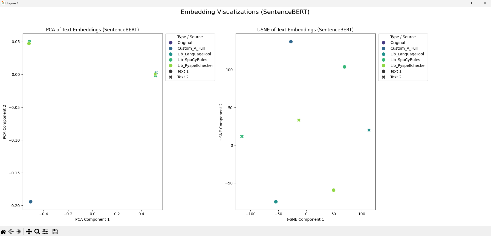

# Semantic Reconstruction & Analysis: An NLP Project

This repository contains the code for my university project on Natural Language Processing. The project focuses on "semantic reconstruction"—the process of correcting grammatically flawed text while preserving its original meaning.

The core idea is to take two sample texts with common errors, apply various correction techniques (both manual and automated), and then use computational methods to prove that the meaning of the texts wasn't lost in the process.

## 📋 Key Features

-   **Text Reconstruction:** Implements both manual fixes and automated correction using popular Python libraries.
-   **Correction Libraries Used:**
    -   `language-tool-python` for comprehensive grammar and style checks.
    -   `pyspellchecker` for fixing spelling mistakes.
    -   `spaCy` for rule-based grammatical corrections.
-   **Semantic Analysis:** Uses `Sentence-BERT` to create high-quality text embeddings.
-   **Similarity Measurement:** Calculates Cosine Similarity to objectively measure how close the reconstructed texts are to their originals in meaning.
-   **Visualization:** Generates PCA and t-SNE plots to visually represent the semantic relationships between the different text versions.
-   **Bonus Task:** Includes a fun experiment using a Greek BERT model (`nlpaueb/bert-base-greek-uncased-v1`) for a masked language modeling task.

## ⚙️ Setup and Installation

Follow these steps to get the project running on your local machine.

**1. Clone the Repository**
```bash
git clone https://github.com/nerflifepls/nlp.git
```
**2. Create a Virtual Environment (Recommended)**

It's best practice to use a virtual environment to keep dependencies isolated.
Generated bash
```bash
# For macOS/Linux
python3 -m venv venv
source venv/bin/activate

# For Windows
python -m venv venv
.\venv\Scripts\activate
```
**3. Install Dependencies**

Install all the required Python packages using the requirements.txt file.
```Bash
pip install -r requirements.txt
```
***Important Note:***

 language-tool-python requires a Java runtime environment (JRE). If you don't have Java installed, you might need to install it for this part of the script to work.

**4. Download NLP Models**
```bash
The script will automatically try to download the necessary spaCy and gensim models on its first run. This might take some time and a good amount of disk space, so be patient!
spaCy models: en_core_web_lg, el_core_news_sm
gensim models: word2vec-google-news-300, fasttext-wiki-news-subwords-300
```
▶️ How to Run
Once you have everything set up, just run the main.py script from your terminal:
```Bash
python main.py
```

**The script will:**
Print detailed logs of its progress to the console.
Perform all text reconstructions and computational analyses.
Display a summary table of the cosine similarity scores.
Generate and show a Matplotlib window with the PCA and t-SNE plots. The plot will also be saved as Figure_1.png in the project directory.

**📊 Results Visualization**
The script generates a visualization to show how the different text versions relate to each other semantically. Texts that are close in meaning appear close together in the plot. As you can see below, the reconstructions for each text form tight, distinct clusters, proving the meaning was preserved.


**🛠️ Technologies Used**

Python 3.10

PyTorch

Transformers (Hugging Face)

Sentence-BERT

spaCy

Gensim

scikit-learn

Matplotlib

pandas